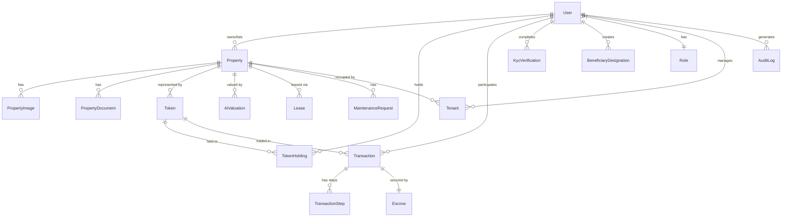

# TIGI — Database Schema Outline

> **Version:** 1.0  
> **Status:** Draft  
> **Last updated:** March 7, 2026  
> **ORM:** Prisma (PostgreSQL)

---

## 1. Schema Philosophy

- **Relational integrity** — Foreign keys and constraints enforce data consistency for financial-grade operations
- **Soft deletes** — Critical records use `deletedAt` timestamps instead of hard deletes
- **Audit-ready** — All tables include `createdAt`, `updatedAt`; sensitive tables include `createdBy`
- **UUID primary keys** — For security (non-enumerable) and distributed-friendliness
- **Enum types** — Database-level enums for status fields to prevent invalid states

---

## 2. Entity Relationship Overview

---

## 3. Core Tables

### 3.1 `User`
| Column | Type | Description |
|---|---|---|
| `id` | UUID (PK) | Unique identifier |
| `email` | String (unique) | Login email |
| `name` | String | Display name |
| `avatarUrl` | String? | Profile picture URL |
| `role` | Enum: `INVESTOR`, `OWNER`, `MANAGER`, `ADMIN`, `COMPLIANCE_OFFICER` | Platform role |
| `kycStatus` | Enum: `NOT_STARTED`, `PENDING`, `VERIFIED`, `REJECTED` | KYC verification status |
| `walletAddress` | String? | Solana wallet public key (optional) |
| `custodialWalletId` | String? | Internal custodial wallet reference |
| `emailVerified` | Boolean | Email confirmation status |
| `twoFactorEnabled` | Boolean | 2FA status |
| `lastLoginAt` | DateTime? | Last login timestamp |
| `createdAt` | DateTime | Account creation |
| `updatedAt` | DateTime | Last modification |
| `deletedAt` | DateTime? | Soft delete |

### 3.2 `Property`
| Column | Type | Description |
|---|---|---|
| `id` | UUID (PK) | Unique identifier |
| `ownerId` | UUID (FK → User) | Listing owner |
| `title` | String | Property title |
| `description` | Text | Full description |
| `type` | Enum: `RESIDENTIAL`, `COMMERCIAL`, `LAND`, `INDUSTRIAL`, `MIXED_USE` | Property type |
| `status` | Enum: `DRAFT`, `UNDER_REVIEW`, `ACTIVE`, `SOLD`, `LEASED`, `DELISTED` | Listing status |
| `price` | Decimal | Asking price (USD) |
| `currency` | String | Currency code (default: USD) |
| `address` | String | Street address |
| `city` | String | City |
| `state` | String | State/province |
| `country` | String | Country code |
| `postalCode` | String | Zip/postal code |
| `latitude` | Float? | GPS latitude |
| `longitude` | Float? | GPS longitude |
| `squareFeet` | Int? | Size in sq ft |
| `bedrooms` | Int? | Number of bedrooms |
| `bathrooms` | Float? | Number of bathrooms |
| `yearBuilt` | Int? | Construction year |
| `parcelId` | String? | Legal parcel identifier |
| `zoningType` | String? | Zoning classification |
| `isTokenized` | Boolean | Whether property has been tokenized |
| `tokenId` | UUID? (FK → Token) | Associated token |
| `featuredAt` | DateTime? | Featured listing timestamp |
| `reviewedBy` | UUID? (FK → User) | Compliance reviewer |
| `reviewedAt` | DateTime? | Review timestamp |
| `createdAt` | DateTime | |
| `updatedAt` | DateTime | |
| `deletedAt` | DateTime? | |

### 3.3 `PropertyImage`
| Column | Type | Description |
|---|---|---|
| `id` | UUID (PK) | |
| `propertyId` | UUID (FK → Property) | Parent property |
| `url` | String | Storage URL |
| `alt` | String? | Alt text |
| `order` | Int | Display order |
| `isPrimary` | Boolean | Hero image flag |
| `createdAt` | DateTime | |

### 3.4 `PropertyDocument`
| Column | Type | Description |
|---|---|---|
| `id` | UUID (PK) | |
| `propertyId` | UUID (FK → Property) | Parent property |
| `type` | Enum: `TITLE`, `DEED`, `SURVEY`, `INSPECTION`, `APPRAISAL`, `CONTRACT`, `OTHER` | Document type |
| `name` | String | Display name |
| `url` | String | Storage URL |
| `mimeType` | String | File MIME type |
| `sizeBytes` | Int | File size |
| `verificationStatus` | Enum: `PENDING`, `VERIFIED`, `REJECTED` | Review status |
| `verifiedBy` | UUID? (FK → User) | Reviewer |
| `aiSummary` | Text? | AI-generated summary |
| `uploadedBy` | UUID (FK → User) | Uploader |
| `createdAt` | DateTime | |

---

## 4. Blockchain Tables

### 4.1 `Token`
| Column | Type | Description |
|---|---|---|
| `id` | UUID (PK) | Internal ID |
| `propertyId` | UUID (FK → Property) | Linked property |
| `mintAddress` | String (unique) | Solana SPL token mint address |
| `totalSupply` | Int | Total fractions minted |
| `availableSupply` | Int | Fractions available for purchase |
| `pricePerToken` | Decimal | Current price per fraction (USD) |
| `metadataUri` | String? | On-chain metadata URI |
| `status` | Enum: `MINTING`, `ACTIVE`, `FROZEN`, `BURNED` | Token lifecycle status |
| `mintedBy` | UUID (FK → User) | Admin who triggered minting |
| `mintedAt` | DateTime? | Minting confirmation time |
| `createdAt` | DateTime | |
| `updatedAt` | DateTime | |

### 4.2 `TokenHolding`
| Column | Type | Description |
|---|---|---|
| `id` | UUID (PK) | |
| `userId` | UUID (FK → User) | Token holder |
| `tokenId` | UUID (FK → Token) | Token reference |
| `quantity` | Int | Number of fractions held |
| `averageCostBasis` | Decimal | Average purchase price |
| `acquiredAt` | DateTime | First acquisition date |
| `updatedAt` | DateTime | |

**Unique constraint:** `(userId, tokenId)`

---

## 5. Transaction Tables

### 5.1 `Transaction`
| Column | Type | Description |
|---|---|---|
| `id` | UUID (PK) | |
| `type` | Enum: `PURCHASE`, `SALE`, `LEASE`, `TRANSFER`, `INHERITANCE` | Transaction type |
| `status` | Enum: `INITIATED`, `ESCROW_FUNDED`, `INSPECTION`, `LEGAL_REVIEW`, `SETTLEMENT`, `COMPLETED`, `CANCELLED`, `DISPUTED` | Workflow status |
| `buyerId` | UUID (FK → User) | Buyer/investor |
| `sellerId` | UUID (FK → User) | Seller/owner |
| `propertyId` | UUID (FK → Property) | Property involved |
| `tokenId` | UUID? (FK → Token) | Token (for fractional trades) |
| `quantity` | Int? | Token quantity (for fractional) |
| `amount` | Decimal | Total transaction amount (USD) |
| `platformFee` | Decimal | TIGI commission |
| `escrowId` | UUID? (FK → Escrow) | Associated escrow |
| `solanaSignature` | String? | On-chain transaction signature |
| `notes` | Text? | Internal notes |
| `createdAt` | DateTime | |
| `updatedAt` | DateTime | |
| `completedAt` | DateTime? | Settlement timestamp |

### 5.2 `TransactionStep`
| Column | Type | Description |
|---|---|---|
| `id` | UUID (PK) | |
| `transactionId` | UUID (FK → Transaction) | Parent transaction |
| `step` | Enum: `OFFER`, `ACCEPTANCE`, `ESCROW_DEPOSIT`, `INSPECTION`, `LEGAL_REVIEW`, `TITLE_VERIFICATION`, `SETTLEMENT`, `TOKEN_TRANSFER` | Step type |
| `status` | Enum: `PENDING`, `IN_PROGRESS`, `COMPLETED`, `FAILED`, `SKIPPED` | Step status |
| `assignedTo` | UUID? (FK → User) | Responsible party |
| `dueDate` | DateTime? | Expected completion |
| `completedAt` | DateTime? | Actual completion |
| `notes` | Text? | |
| `createdAt` | DateTime | |

### 5.3 `Escrow`
| Column | Type | Description |
|---|---|---|
| `id` | UUID (PK) | |
| `transactionId` | UUID (FK → Transaction) | Parent transaction |
| `escrowAddress` | String? | Solana escrow program account |
| `amount` | Decimal | Escrowed amount |
| `status` | Enum: `CREATED`, `FUNDED`, `RELEASED`, `REFUNDED`, `DISPUTED` | Escrow status |
| `fundedAt` | DateTime? | |
| `releasedAt` | DateTime? | |
| `createdAt` | DateTime | |
| `updatedAt` | DateTime | |

---

## 6. Compliance Tables

### 6.1 `KycVerification`
| Column | Type | Description |
|---|---|---|
| `id` | UUID (PK) | |
| `userId` | UUID (FK → User) | Applicant |
| `provider` | String | KYC provider name |
| `providerRefId` | String? | External reference ID |
| `status` | Enum: `SUBMITTED`, `IN_REVIEW`, `APPROVED`, `REJECTED`, `EXPIRED` | Verification status |
| `level` | Enum: `BASIC`, `ENHANCED`, `INSTITUTIONAL` | Verification tier |
| `rejectionReason` | String? | If rejected |
| `reviewedBy` | UUID? (FK → User) | Internal reviewer |
| `expiresAt` | DateTime? | Verification expiry |
| `createdAt` | DateTime | |
| `updatedAt` | DateTime | |

### 6.2 `AuditLog`
| Column | Type | Description |
|---|---|---|
| `id` | UUID (PK) | |
| `userId` | UUID? (FK → User) | Actor (null for system actions) |
| `action` | String | Action type (e.g., `property.created`, `kyc.approved`) |
| `resource` | String | Resource type |
| `resourceId` | String | Resource identifier |
| `metadata` | JSON | Additional context |
| `ipAddress` | String? | Client IP |
| `userAgent` | String? | Client user agent |
| `createdAt` | DateTime | Immutable timestamp |

**Note:** This table is append-only. No UPDATE or DELETE operations.

---

## 7. Inheritance Tables

### 7.1 `BeneficiaryDesignation`
| Column | Type | Description |
|---|---|---|
| `id` | UUID (PK) | |
| `ownerId` | UUID (FK → User) | Asset owner |
| `beneficiaryEmail` | String | Heir's contact (may not be a user yet) |
| `beneficiaryUserId` | UUID? (FK → User) | Heir's user ID (if registered) |
| `tokenId` | UUID (FK → Token) | Token to transfer |
| `sharePercentage` | Decimal | Percentage of holdings to transfer |
| `triggerType` | Enum: `MANUAL`, `DATE`, `INACTIVITY`, `LEGAL_DOCUMENT` | Transfer trigger |
| `triggerDate` | DateTime? | For date-based triggers |
| `inactivityDays` | Int? | For inactivity-based triggers |
| `status` | Enum: `ACTIVE`, `TRIGGERED`, `COMPLETED`, `REVOKED` | Designation status |
| `createdAt` | DateTime | |
| `updatedAt` | DateTime | |

---

## 8. Lease Tables

### 8.1 `Lease`
| Column | Type | Description |
|---|---|---|
| `id` | UUID (PK) | |
| `propertyId` | UUID (FK → Property) | Leased property |
| `landlordId` | UUID (FK → User) | Property owner |
| `tenantId` | UUID? (FK → User) | Lessee |
| `type` | Enum: `RESIDENTIAL`, `COMMERCIAL`, `AGRICULTURAL`, `DEVELOPMENT` | Lease type |
| `status` | Enum: `DRAFT`, `PENDING_APPROVAL`, `ACTIVE`, `EXPIRED`, `TERMINATED` | Lease status |
| `startDate` | DateTime | Lease start |
| `endDate` | DateTime | Lease end |
| `monthlyRent` | Decimal | Monthly payment |
| `depositAmount` | Decimal | Security deposit |
| `terms` | Text | Lease terms summary |
| `permittedUse` | String? | Allowed use of property |
| `smartContractAddress` | String? | On-chain lease contract |
| `createdAt` | DateTime | |
| `updatedAt` | DateTime | |

---

## 9. Property Management Tables

### 9.1 `Tenant`
| Column | Type | Description |
|---|---|---|
| `id` | UUID (PK) | |
| `propertyId` | UUID (FK → Property) | Occupied property |
| `userId` | UUID? (FK → User) | Tenant user account |
| `name` | String | Tenant name |
| `email` | String | Contact email |
| `phone` | String? | Contact phone |
| `leaseId` | UUID? (FK → Lease) | Associated lease |
| `moveInDate` | DateTime | |
| `moveOutDate` | DateTime? | |
| `status` | Enum: `ACTIVE`, `NOTICE_GIVEN`, `MOVED_OUT` | |
| `createdAt` | DateTime | |
| `updatedAt` | DateTime | |

### 9.2 `MaintenanceRequest`
| Column | Type | Description |
|---|---|---|
| `id` | UUID (PK) | |
| `propertyId` | UUID (FK → Property) | Property |
| `tenantId` | UUID (FK → Tenant) | Requesting tenant |
| `title` | String | Issue summary |
| `description` | Text | Detailed description |
| `priority` | Enum: `LOW`, `MEDIUM`, `HIGH`, `EMERGENCY` | Priority level |
| `status` | Enum: `SUBMITTED`, `ASSIGNED`, `IN_PROGRESS`, `COMPLETED`, `CLOSED` | Request status |
| `assignedTo` | String? | Vendor or person assigned |
| `resolvedAt` | DateTime? | |
| `createdAt` | DateTime | |
| `updatedAt` | DateTime | |

---

## 10. AI Tables

### 10.1 `AiValuation`
| Column | Type | Description |
|---|---|---|
| `id` | UUID (PK) | |
| `propertyId` | UUID (FK → Property) | Valued property |
| `estimatedValue` | Decimal | AI-estimated value (USD) |
| `confidenceScore` | Float | 0.0–1.0 confidence |
| `modelVersion` | String | Model identifier |
| `inputs` | JSON | Input features used |
| `comparables` | JSON? | Comparable properties referenced |
| `createdAt` | DateTime | Valuation timestamp |

---

## 11. Indexing Strategy

### Primary Indexes (auto-created by PK)
- All `id` columns

### Critical Secondary Indexes
| Table | Index | Purpose |
|---|---|---|
| `User` | `email` (unique) | Login lookup |
| `User` | `walletAddress` (unique, partial) | Wallet-based lookup |
| `Property` | `(status, type, city)` | Marketplace filtering |
| `Property` | `ownerId` | Owner's listings |
| `Property` | `price` | Price range queries |
| `Token` | `mintAddress` (unique) | On-chain lookup |
| `TokenHolding` | `(userId, tokenId)` (unique) | Portfolio queries |
| `Transaction` | `(buyerId, status)` | User's transactions |
| `Transaction` | `(sellerId, status)` | User's transactions |
| `AuditLog` | `(userId, createdAt)` | User audit history |
| `AuditLog` | `(resource, resourceId)` | Resource audit trail |
| `Lease` | `(propertyId, status)` | Active lease lookup |

---

## 12. Migration Strategy

- Prisma Migrate for all schema changes
- Migrations committed to version control
- Naming convention: descriptive names (e.g., `add_token_holdings_table`)
- Zero-downtime migrations: additive changes first, destructive changes with deprecation period
- Seed data script for development and staging environments
