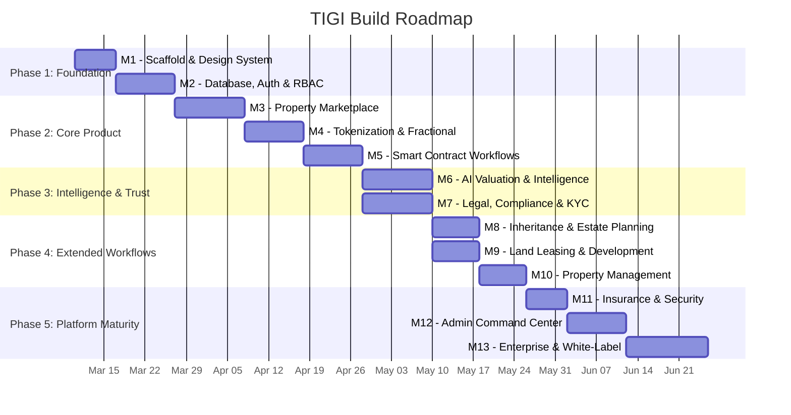
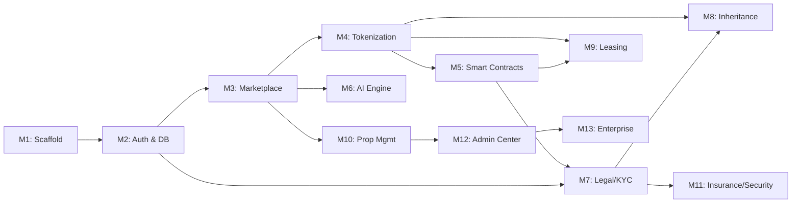

# TIGI — Build Roadmap

> **Version:** 1.0  
> **Status:** Draft  
> **Last updated:** March 7, 2026

---

## 1. Roadmap Overview

---

## 2. Phase Breakdown

### Phase 1: Foundation (Weeks 1–3)
**Objective:** Build the technical skeleton and design system that every future feature depends on.

| Milestone | Duration | Key Deliverables |
|---|---|---|
| **M1 — Scaffold & Design System** | ~1 week | Next.js 15 project, Tailwind + shadcn/ui with TIGI tokens, core layout shell, landing page |
| **M2 — Database, Auth & RBAC** | ~1.5 weeks | PostgreSQL + Prisma schema, auth (email + OAuth + wallet-optional), RBAC middleware, user management |

**Phase exit criteria:** A user can register, log in, navigate the platform shell, and see role-appropriate navigation.

---

### Phase 2: Core Product (Weeks 4–8)
**Objective:** Deliver the primary user experience — marketplace, tokenized investing, and smart contract transactions.

| Milestone | Duration | Key Deliverables |
|---|---|---|
| **M3 — Property Marketplace** | ~1.5 weeks | Listing creation, browse/search/filter, property detail pages, owner dashboard |
| **M4 — Tokenization & Fractional Ownership** | ~1.5 weeks | Solana wallet integration, token minting, fractional investment flow, portfolio page |
| **M5 — Smart Contract Transactions** | ~1.5 weeks | Escrow program (Anchor), purchase workflow, transaction tracker, notifications |

**Phase exit criteria:** A user can browse properties, invest fractionally via Solana, and complete a full purchase transaction with escrow. This is the **MVP milestone**.

---

### Phase 3: Intelligence & Trust (Weeks 9–12)
**Objective:** Add the AI intelligence layer and compliance infrastructure that make TIGI enterprise-grade.

| Milestone | Duration | Key Deliverables |
|---|---|---|
| **M6 — AI Valuation & Intelligence** | ~1.5 weeks | Valuation model, market dashboard, investment recommendations, property comparison |
| **M7 — Legal, Compliance & KYC** | ~1.5 weeks | KYC/AML flow, document management, compliance dashboard, audit trail |

**Note:** M6 and M7 can be developed **in parallel** since they have no mutual dependency — M6 depends on M3 (properties exist) and M7 depends on M2+M5 (auth + transactions exist).

**Phase exit criteria:** Properties have AI valuations, users can complete KYC, and compliance officers can review/approve.

---

### Phase 4: Extended Workflows (Weeks 13–16)
**Objective:** Build the differentiating workflows — inheritance, leasing, and property management.

| Milestone | Duration | Key Deliverables |
|---|---|---|
| **M8 — Inheritance & Estate Planning** | ~1 week | Beneficiary designation, transfer conditions, estate dashboard |
| **M9 — Land Leasing & Development** | ~1 week | Lease listings, application workflow, payment schedules |
| **M10 — Property Management** | ~1 week | Tenant management, maintenance requests, financial dashboard |

**Note:** M8 and M9 can be developed **in parallel** after M7.

**Phase exit criteria:** Owners can set up inheritance plans, list land for lease, and manage rental properties through TIGI.

---

### Phase 5: Platform Maturity (Weeks 17–22)
**Objective:** Harden the platform with security, full admin tooling, and enterprise readiness.

| Milestone | Duration | Key Deliverables |
|---|---|---|
| **M11 — Insurance & Security** | ~1 week | Insurance UI, 2FA, anomaly detection, security audit log |
| **M12 — Admin Command Center** | ~1.5 weeks | Full admin dashboard, user/transaction/compliance management |
| **M13 — Enterprise & White-Label** | ~2 weeks | Multi-tenancy, configurable branding, API docs, partner onboarding |

**Phase exit criteria:** Platform is hardened, fully administrable, and architecturally ready for enterprise/partner deployments.

---

## 3. Dependency Graph

---

## 4. Key Checkpoints

| Checkpoint | When | What's Demonstrated |
|---|---|---|
| **Internal Demo 1** | End of M3 | Marketplace browsable, properties listed, premium UI |
| **Internal Demo 2 (MVP)** | End of M5 | Full investment + transaction flow on Solana Devnet |
| **Stakeholder Demo** | End of M7 | AI valuations, KYC flow, compliance review working |
| **Feature Complete** | End of M10 | All user-facing workflows implemented |
| **Platform Launch Ready** | End of M12 | Hardened, monitored, fully administrable |
| **Enterprise Ready** | End of M13 | Multi-tenant, API-documented, partner-ready |

---

## 5. Parallelization Opportunities

| Parallel Track A | Parallel Track B | Prerequisite |
|---|---|---|
| M6 (AI Engine) | M7 (Legal/KYC) | Both start after M5 |
| M8 (Inheritance) | M9 (Leasing) | Both start after M7 |
| Frontend polish | Backend hardening | Ongoing from M3 onward |

---

## 6. Tooling & Process

| Activity | Tool |
|---|---|
| Mission planning & architecture | Antigravity (this tool) |
| Code implementation | Claude Code with Opus 4.6 |
| Version control | Git + GitHub |
| Project tracking | task.md + milestone checklist |
| Code review | PR-based with AI-assisted review |
| Testing | Jest + Playwright + browser verification |
| Deployment | Vercel (auto-deploy on push) |
| Monitoring | Sentry (errors) + Vercel Analytics |
